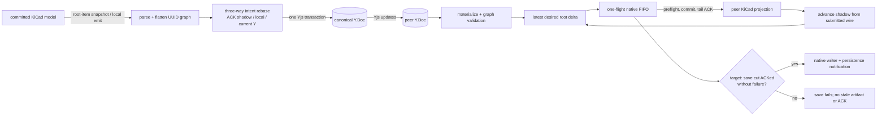
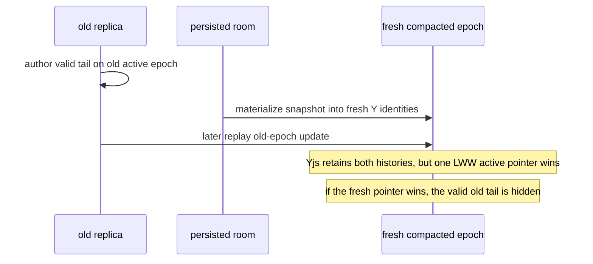

# Yjs ⇄ native correctness contract

Status: active contract and evidence map for `codex/yjs-properties`.

This document defines the claims the implementation and regression suite are
allowed to make.  It deliberately does not claim that every pair of KiCad
edits commutes.  A native snapshot does not retain identities for every
anonymous s-expression child, so some simultaneous edits are genuine
conflicts. Correctness means that compatible intentions survive, conflicts
have one documented policy, invalid intermediate data never reaches the
editor, healthy replicas converge, and terminal or malformed cases fail closed
behind an explicit recovery boundary.

## The state machine in one picture



Yjs is authoritative only in the middle of this graph. It guarantees that the
same set of valid Yjs updates converges. It does not prove the native parser,
the handwritten conflict-domain cut, the asynchronous controller, or the
KiCad writer. Those arrows need separate proofs and refinement tests.

## The two conversion algorithms

### Native to Yjs

1. A committed native edit emits complete changed **root** s-expressions. The
   PCB root iterator includes footprints, tracks/vias/arcs, zones, drawings,
   groups and generators. A changed nested child is lifted to its root because
   C++ replaces roots, not detached children.
2. `fileToDoc`/the item-wire parser turns s-expressions into a `KicadDoc`.
   Independently addressable UUID nodes are flattened into `items`; the
   nearest owner's UUID is recorded as `parent`. A writer-owned child that
   repeats its nearest owner's UUID stays inline instead of pretending to be a
   second object. Ordered atoms and repeated anonymous fields remain slots.
3. The binding interprets the emission as intent relative to the exact last
   acknowledged native shadow. For each declared conflict domain it evaluates
   `(base, local, currentY)`: unchanged local state preserves current Y;
   unchanged current Y accepts local; disjoint changes keep both; a same-domain
   write submits one complete local value and Yjs deterministically selects the
   concurrent winner.
4. One Yjs transaction updates the v3 active epoch. UUID items are independent
   entries; audited semantic fields are independent entries; ambiguous
   sequences are atomic values; root layout is stored as atomic per-head
   groups; embedded libraries are keyed by library ID.

### Yjs to native

1. The binding materializes the latest Y state, validates/canonicalizes its
   parent/reference graph and compares non-item structure with the native
   baseline. Hard root/layout changes are not guessed. A library change is hot
   applicable only when the exact desired definition accompanies every
   consumer root affected by the request; otherwise recovery is a fresh
   editor hydrated from Yjs.
2. The latest desired state is diffed against the acknowledged native shadow.
   Updated children are lifted and rendered as complete roots. One request may
   be in flight; newer revisions coalesce into one latest follow-up.
3. C++ parses **every** bare PCB root inside a temporary board envelope. That
   supplies the file version, layers and a board for resolving nets. Before the
   temporary board is destroyed, footprint net references and component-class
   references are rebound to the live board. The complete batch is preflighted
   before mutation, committed through the editor, and acknowledged only at the
   FIFO body's tail.
4. On a successful ACK, the browser advances its shadow from that request's
   exact wire and non-item target, never from a later snapshot. If a newer Y
   revision arrived meanwhile, the level-triggered pump immediately computes
   the next delta.

The roundtrip claim is therefore:

```text
valid representable native file
  -> canonical KicadDoc/Yjs state
  -> fresh native owner
  -> native save
  ≈ the original file semantically
```

It is not byte identity, and it is not a claim that an arbitrary malformed Y
document or an already-terminal native instance can be repaired in place.

## State and equivalence

`Valid(d)` means all of the following:

1. `d` has the `KicadDoc` structural shape.
2. Every item reference resolves to an item.
3. Every item is referenced exactly once.
4. A root reference points to an item whose `parent` is `null`.
5. A reference inside item `p` points to an item whose `parent` is `p`.
6. Every non-null parent exists.
7. The parent graph is acyclic and every traversal terminates.

`a ≈ b` is canonical KiCad equivalence: parsing the rendered documents and
normalizing writer-controlled formatting/order produces the same tree.  Byte
identity is not required because KiCad's native writer normalizes files.

The authoritative state is the current Yjs state epoch.  A native editor is a
fallible asynchronous projection of that epoch.  `desiredRevision` is the
latest valid Y state known to a binding, `inFlightRevision` is at most one
native projection, and `appliedRevision` is the last projection acknowledged
after native commit. The native shadow advances from that exact submitted wire;
an acknowledgement-time snapshot must not destructively redefine the base for
concurrent local intent.

## Laws

These are the target laws. They are not all universal theorems about arbitrary
KiCad input: the evidence ledger distinguishes abstractly proved policy,
finite deterministic/combinatorial tests, real-Wasm refinement, and trusted
dependencies.

### Pure representation

- Canonical roundtrip: `decode(encode(d)) ≈ d` for every representable valid
  document.
- Normalization: `normalize(normalize(d)) = normalize(d)`.
- Delta soundness: applying the semantic delta from `a` to `b` to `a` yields
  `b`, modulo canonical normalization.
- Migration preservation and idempotence: `migrate(d) ≈ d` and a second
  migration is a no-op.
- Closed-state rewrite preservation: materializing and re-encoding a fixed,
  closed update preserves the visible document and every registered auxiliary
  root. This does **not** authorize replacing a live room's Yjs identities.
  Current-version on-load compaction is disabled until a real replica fence can
  exclude or rebase hibernated/offline writers from the old epoch.

### Replication

- Same-update-set convergence: delivery order, duplication, batching, and a
  temporary partition do not change the final visible state.
- Compatible-intention preservation: edits in independent conflict domains
  both survive.
- Conflict determinism: edits in one conflict domain resolve to one complete
  value; a merge may not construct a hybrid value that no client authored.
- Atomic seed epoch: concurrent first seeds select one complete seed, never a
  union of roots, items, layout, or library definitions.
- Graph closure: decoding and every accepted local transition return `Valid`.

### Native projection

- No forgotten desired revision: a remote Y update is either acknowledged by
  native, superseded by a newer desired revision, or retained for retry.
- No stale publication: local native output is interpreted relative to the
  last acknowledged native shadow; unchanged stale fields may not overwrite
  newer Y fields.
- Preflight/acknowledgement atomicity: a preflight-rejected batch changes
  nothing, and an `applied` acknowledgement occurs only after the complete
  prepared commit. If an exception occurs after native staging begins, the
  outcome is unknown and the instance is terminal; rollback is not claimed.
- Fixed point/no echo: projecting an already-applied revision creates no new
  semantic Y update.
- Conditional eventual projection: under fair scheduling, no terminal failure,
  and eventually successful native calls, quiescence is expected to imply
  `native ≈ decode(Y)`. This is an operational liveness target supported by
  tests, not a temporal theorem in the current Dafny model.
- Lifecycle isolation: completion from an old binding generation cannot mutate
  a new file/room.
- Emission-order safety: production local flushes and remote applies share one
  strict native FIFO, remote-apply echoes are suppressed, and the ACK is emitted
  at the apply body's tail. Under that opt-in bridge contract, a local emission
  observed before the outstanding ACK is causally **before** that apply and can
  be rebased normally. A fake or alternate bridge without this causal contract
  still fails closed and requires a fresh editor rather than guessing order.
- Structural projection: the live item bridge is used only while hard native
  and Yjs non-item signatures agree. A remote root/layout change retires the
  current instance. A library-definition change may cross only when the exact
  submitted root wire proves coverage of every affected native and desired
  consumer; definition deletion, definition-only change and unsafe shared
  consumers require explicit recreate-from-Y recovery.

### Failure and durability

- Malformed Y or wire data leaves native at its last-good revision and produces
  one observable terminal rejection. A malformed authority reports
  `repair-yjs-before-recreate`; a future encoding reports `upgrade-client`.
  Reloading an unchanged malformed room is not presented as recovery.
- Busy/open-in-flight is retryable and cannot drop a revision.
- An explicitly transient `busy`/`unavailable` rejection retries from the
  latest desired state with bounded queue size. A timeout, malformed/partial
  result, trap, or any unknown native state is terminal for that Wasm instance:
  recreate it and hydrate from Y.
- A native emission during an unresolved remote apply is accepted in place only
  when the bridge advertises and implements the strict FIFO/pre-apply causal
  contract above. Without that proof, its ordering is unknown even when both
  payloads are valid; intent is retained in Yjs and the old native instance is
  terminal.
- A programmatic document load after a remote native commit is also
  recreate-only in this JSPI build; same-instance continuation is not part of
  the correctness claim.
- An edit is called durable only after the persistence layer has acknowledged
  it; state accepted only into a debounce buffer is not yet durable.
- The abstract `SaveCut` policy freezes the accepted ticket prefix and permits
  persistence only after that prefix is acknowledged; timeout or a failure
  through the cut fails closed. The concrete Wasm hook currently observes only
  native `busy/queue-empty` and waits up to 35 seconds. It closes the
  pending-apply race for successful entries, but it is **not yet a complete
  refinement**: a failed apply can leave the queue empty without retaining a
  failed-ticket frontier, after which save could serialize stale native state.
  It also has no fixed cut, so continuous later arrivals can extend the wait.
  Until native accepted/ACKed/failed frontiers are wired to the writer, the full
  save-cut guarantee is a target theorem plus partial E2E evidence, not a
  production theorem. A projection timeout terminalizes the binding; recovery
  is a fresh native instance hydrated from authoritative Y, never a same-owner
  save retry.

## Conflict domains

The v3 schema uses stable identities where the source format supplies them:

- uuid-bearing items and child references: UUID;
- explicitly keyed records: stable semantic key;
- different field heads: independent map entries;
- anonymous repeated children and positional atoms: one atomic sequence value.

The last row is intentional.  Native snapshots cannot distinguish, in the
general case, "insert a duplicate before element 1" from "replace element 1 and
append its old value".  Assigning random IDs after the fact only hides that
ambiguity.  Until the native bridge emits durable semantic element IDs or
operations, an anonymous sequence is one LWW conflict domain.  Concurrent
edits converge to one whole authored sequence; they do not silently mix or
mis-associate elements.

## Why online compaction needs a replica fence

Compacting by materializing a Y document into a fresh `Y.Doc` preserves one
closed snapshot but changes every Yjs client/item identity. `BoardRoom.onLoad`
runs before new handshakes, but it does not prove that all old replicas are
gone: a hibernated connection or an offline client may later replay a valid
tail authored against the old epoch.



The current policy rejects a `reason: "compaction"` rewrite at load time. A
safe future protocol needs an explicit generation/fence, admission that rejects
old writers, acknowledgement/drain of the old generation, and a specified way
to rebase any retained tail. The existing version-upgrade rewrite remains a
separate compatibility path; this counterexample does not prove it safe against
arbitrary offline legacy replicas.

## Evidence layers and trusted boundary

1. Deterministic unit tests pin each known counterexample and conflict policy.
2. Deterministic combinatorial tests enumerate specified finite fixtures,
   conflict histories, operation traces, delivery orders, duplicates, batches,
   partitions, normalization cases and migrations.
3. The Dafny model proves abstract algebraic and controller invariants for seed
   epochs, projection tickets, retries, lifecycle generations, save cuts and
   fail-stop recovery. Dafny 4.11.0 currently discharges 99 obligations with
   zero errors; generated decision-table tests enumerate every exported
   Boolean input.
4. Browser/Wasm E2E tests show the production bridge refines the model for real
   KiCad parsers, commits, saves, and reloads.

Yjs's internal CRDT convergence, the JavaScript/Wasm runtime, and KiCad's parser
and writer remain trusted dependencies.  Formal protocol/model results do not
prove arbitrary C++ correct; native differential and E2E tests cover that
refinement boundary.

The handwritten conflict-domain classifier and the completeness of the
non-item projection signature are also trusted semantic boundaries. The Dafny
lemmas assume a correct domain cut and a correct structural signature; finite
schema fixtures and native conflict tests audit that assumption but do not
prove the entire KiCad grammar.

Normal concurrent document values are selected only by Yjs. Production has no
`/room/apply`, `applyExternalUpdate`, `applyRoomUpdate`, or lint-revert path.
The sync service admits one schema, restores persisted state on load, persists
new client-protocol updates, serves validated reads and asks lint to record a
report. Lint returns `authority: "report-only"` and `yStateMutation: "none"`.
`.ydoc.good` may still be written as forensic evidence, but no production path
reads it as authority or applies it to a room.

When a liveness marker says a room is live, machine reads must obtain and
materialize that live state. An unavailable, empty, malformed or non-KiCad live
response fails closed; it may not silently fall back to a stale persisted
`.ydoc` or uploaded file. A known-cold room may use its persisted update.

Recovery is client/Yjs based: repair the authoritative Y state through an
authenticated Yjs protocol connection when repair is possible, then use the
explicit `Reload` action to create a fresh native projection. If the authority
is still malformed, reload reports repair-first again; if it is a future schema,
the client must be upgraded. The backend neither chooses a conflict winner nor
manufactures a corrective document update. Legacy revert metadata/events and
the pure `computeRevertUpdate` helper are not part of this production contract.
