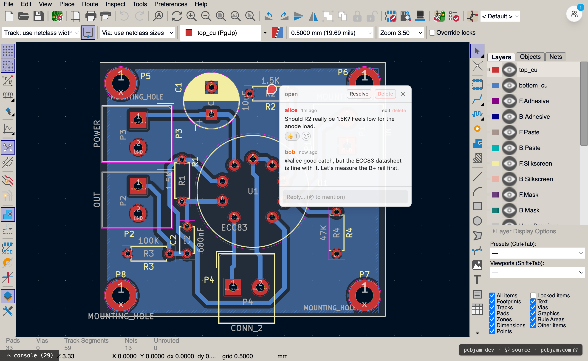
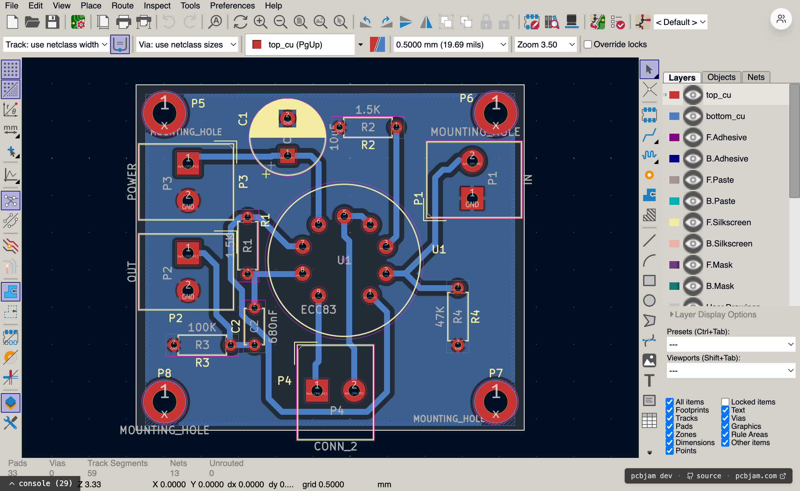
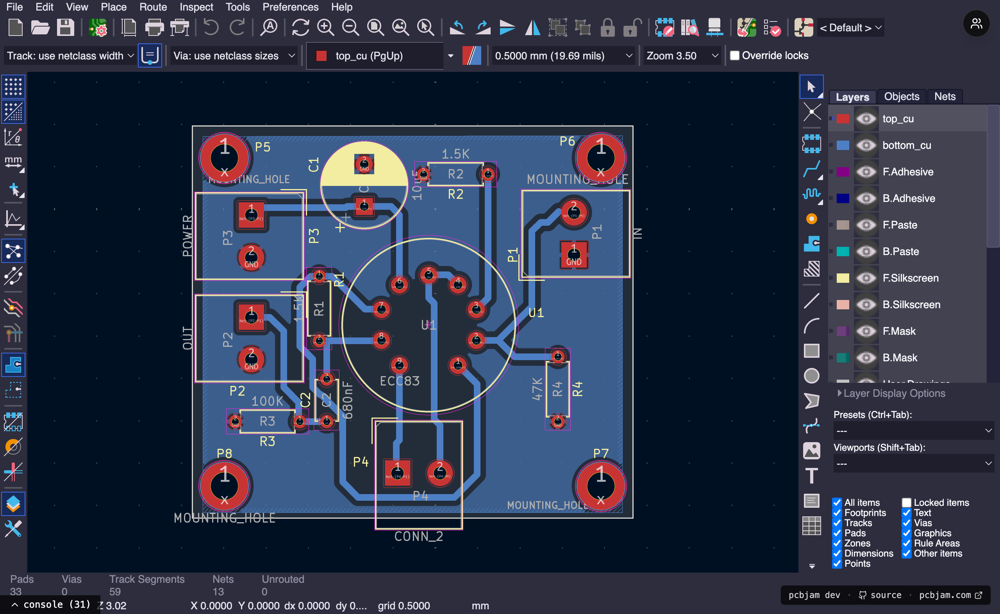
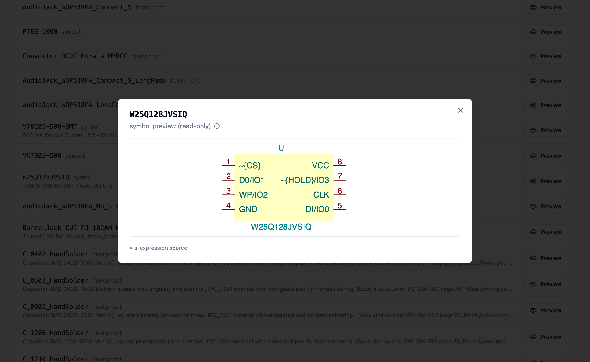

# Moving the infra

Our week's biggest, and also the least interesting challenge was moving the infra on GitHub, Cloudflare, and every other platform we use.
Changing api keys, moving domains, creating accounts, you know the stuff nobody likes, but still you need to do it sometimes, and it's better to do it sooner than later.
So this week's list will be shorter, but I will add screenshots to make it up to you ;)

# Comments

Last time we showed the first version of comments. This week they got a full UX pass.

## Bubble pins and panel

The comment anchors on the canvas are now avatar bubbles (figma style), and we redesigned the floating comments panel that lists the threads.

## Seen, reactions, mentions

Threads now have a "seen" watermark, so you can tell which ones have new activity since you last looked.
You can react to comments with emojis, and you can @-mention your teammates.

## Light and dark editor

The editor now follows the light/dark mode of the platform. This needed changes all the way down in our wxwidgets port, because the editor chrome itself is native UI, not html.

Taking these screenshots for the post is literally how we found (and fixed) white-on-white comboboxes in dark mode.

# The drift robot

Last week we wrote about drift detection: if our implementation has flaws, the editor file and the ydoc file can drift apart.
Detecting the drift is nice, but we wanted to actively hunt for the bugs that cause it.

So we built a robot. Three headless clients join the same document, and play random editor actions from an action catalog. The runs are seeded, so every run is reproducible.
At the end, the harness checks that all three clients and the server converged to the same, valid document.

It found real bugs:
- A wire could end up under the wrong parent when the edit arrived from a remote client.
- Two users duplicating the same element could collide on identity, so duplicate now re-rolls the child uuids.
- Concurrent asyncify fibers inside the WASM editor could step on each other, so we serialized them onto a queue.

# Platform

## Ingest: 4-5 hours to ~15 minutes

Ingesting the official KiCad libs in production was painfully slow, and sometimes failed. We fixed three things:
- GitLab archive downloads were rejected because of a fetch header.
- A retried ingest created duplicate sources, now we reuse the source by its normalized repo url.
- The per-item writes were serial, now they run on a 16-way parallel pool.

A full kicad-symbols ingest went from 4-5 hours to about 15 minutes.

Also, idle worker containers no longer keep themselves alive. They only renew while they are actually busy, which was a nice cost fix.

## Libs UI: sources first

We reworked the libs page around sources (the git repos you ingested) instead of raw lib lists.
Every item now shows its license, and the attribution files are included in the sync bundles.

We also wrote a small pure-TypeScript renderer that turns `.kicad_sym` and `.kicad_mod` files into SVG, so the lib dialogs show an instant preview without booting any WASM.

# Editor

## One step back

Last week we wrote "we fixed (and broke) some context recovery". Well, we broke more than we fixed, so we backed out the WebGL recovery change, and re-landed only the good half separately.

## Assign footprints, now stable

The CvPcb dialog worked, but it could trap on open. The root cause was a thread-safety issue in wxString during the async footprint list loading, which is now fixed down in the wxwidgets layer.
