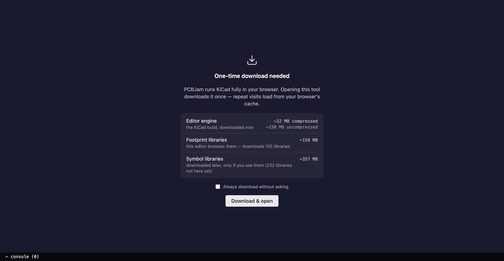
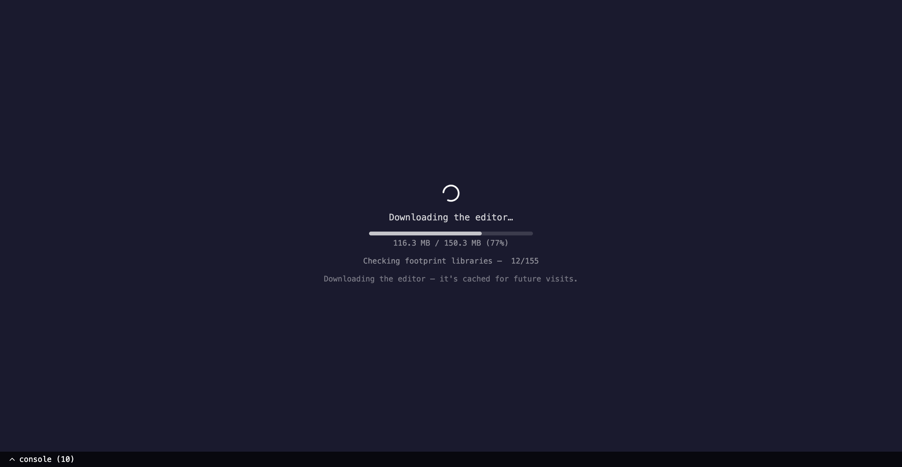
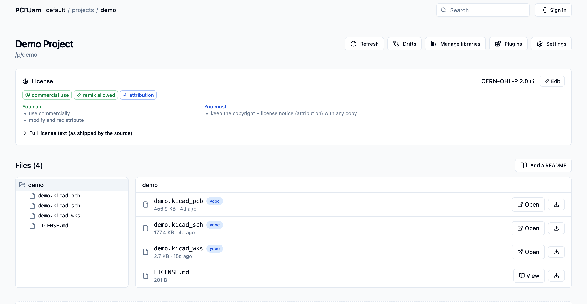
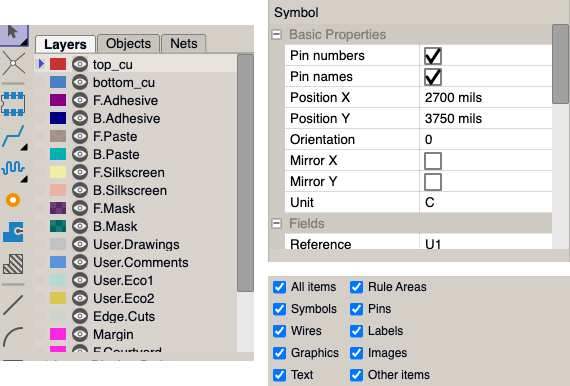

# The board-load crash hunt

Most of this week went into one bug. On big projects, reloading the editor a few times could kill the whole browser tab. Sometimes we got a white screen, sometimes nothing at all, and of course it only happened in production.

## Making crashes visible

The first problem was that we couldn't even see the crash. When the editor died we often got a blank page, because React unmounted our crash reporter while it was crashing (yes, really). So we added a crash screen that lives directly in the DOM below React, where nothing can take it down. We also put the exact build version into every log line, and hooked the editor into our error tracking, so now we hear about crashes even when nobody reports them.

## Finding the trigger

The crash only happened on warm reloads, and only sometimes. We suspected the 3D viewer, the collab layer, file timing, and a few other things, and ruled them out one by one with test builds in production. The actual trigger turned out to be the amount of bytes we load into memory at start. A project stuffed with 120MB of random ballast files (data the editor never even parses) crashed the same way as a real project did. The loading work was simply rolling the dice on a timing window in the editor's async machinery, and bigger projects rolled more dice.

## The fix

KiCad in the browser runs on Asyncify, which lets synchronous C++ code "sleep" while the browser does async work. The crash was a race in exactly that machinery: an event could get dispatched into the engine while it was parked mid-sleep, and the two stepped on each other's stacks. We first built guards around the window (they mostly told us where to look), but the real fix was in our wxwidgets port. Main loop events are now delivered from a fresh browser task, and nothing gets scheduled while a nested loop owns the event pump. After that landed we could delete the guards.

As a bonus, the same race explains a family of "indirect call" traps we had been guarding against for weeks.

# Board load, but faster

Since we were staring at board loading all week anyway, we also made it faster.

## Asking before downloading

The standalone editor now asks before it downloads big libraries, shows the real sizes, and the loading messages tell you what is actually happening (instead of a generic spinner).

## Fewer connections and requests

Opening a board used to open a websocket per library, so a single user could reach 92 connections (Firefox caps you at 200, so a second tab was already trouble). Now it is 3. Library syncing runs on one shared room per team, realtime updates are scoped to the libraries your document actually uses, and warm library opens went from 216 HTTP requests to zero (content digests tell us nothing changed). Project files are also staged into the editor's memory in parallel now.

## Cheaper to run

Our sync rooms used to stay awake as long as a tab was open, now they hibernate when idle. This was the biggest single line on our serverless bill.

We also found that file downloads validated every document three times over on the server. Removing the extra passes made the conversion about 12x faster, and fixed the occasional 503 on large files.

# Collab robustness

The drift robot from last week kept running, and we kept fixing what it (and production) found.

- If one entry in an edit batch could not be applied, we threw away the whole batch, so your last edits were gone. Now we skip the bad entry and apply the rest.
- Files with spaces in their names could end up in the wrong collab room. Room names and document keys are now canonical, and existing documents get migrated lazily.
- One conflict scenario genuinely diverges in a few percent of the runs. The robot caught it, for now it is quarantined, and it will get its own hunt.
- Refreshing the browser on an editor URL now reloads the editor, instead of bouncing you back to the project page.

# Platform

## Project page, round two

The project page got a GitHub-style file browser. Gerbers open in the viewer, libs open in the matching editor, and you can download single files or the whole project as a zip. You can add and edit a README right on the page, and pick a license from a picker (the license then shows up above the files).

# Editor polish

A round of small rendering fixes in the wxwidgets port: sharp toolbar icons on hi-DPI screens, better checkbox density in dialogs, and a clipping fix that cleaned up several redraw glitches all over the UI. On small screens the editor now starts with the chrome hidden, so the canvas gets all the space.

We still have things to fix up, but it's much better than a week ago.
