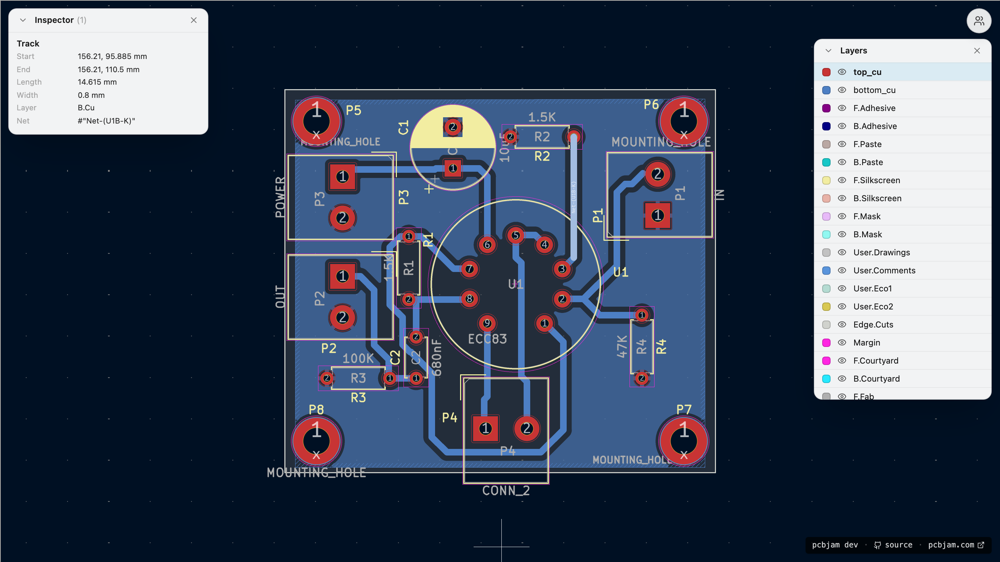
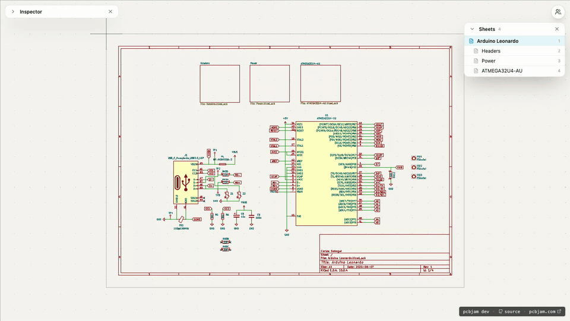
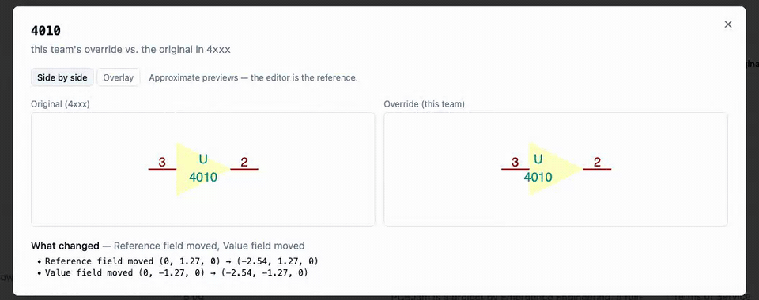

Yes, we skipped four weekly posts. No, we did not stop working. Quite the opposite. The first half of this stretch went into the deepest rewrite this project has seen, the kind where you don't surface to write blog posts. The second half was us cashing in on it. So this one is a long post, covering weeks 32 to 35.

# The big one: we replaced how the editor sleeps

This deserves (and will get) its own full blog post, but here is the short version.

KiCad is synchronous C++ code. The browser is an asynchronous world. Everything interesting and everything terrible about running KiCad in a browser comes from that mismatch. Until now we bridged it with Asyncify, a tool that rewrites the compiled WASM so C++ code can "sleep" while the browser does async work.
It worked, but it was also behind basically every mystery crash we have ever hunted, including the week-31 crash hunt from the last post.

So we stopped patching around it and rewrote the machinery in two stages:

- **Week 32** we rebuilt our async layer from the ground up: every place the C++ side can park got audited and moved onto a proper scheduler with explicit mailboxes, instead of ad-hoc sleeps scattered through the port. The legacy runtime got deleted, not just deprecated.
- **Week 33** we switched the underlying mechanism from Asyncify to **JSPI** (JavaScript Promise Integration), the browser-native way to suspend WebAssembly. This let us delete the entire Asyncify post-processing pipeline from our build.

With the JSPI change;
- We revived 26 tests that had been skipped over the months with "flaky under asyncify" notes, and they pass.
- One collaboration bug that genuinely diverged in a few percent of runs (the quarantined one from the week-31 post) simply does not reproduce under JSPI. We stress-ran it ~100 times and gave up trying.
- The bundle size went down.
- The load-speed, memory usage, fps, basically every performance metric get better.
- We lost Safari and IOS compatibility, but Apple promised that they will enable it in the next Safari release in September, 2026.

We will write a bigger post about this, in the next weeks.

# One request, two websockets

With the engine swap behind us, week 34 went into the load path. Opening a board used to be a small storm of requests; we had already cut the websocket count in July, but the boot sequence itself was still chatty and slow.

Now the editor boots from **one** request. The server resolves the whole project (files, library stack, permissions) in a single round-trip, and everything the editor needs streams in from there.
Realtime runs over exactly two websockets: one gateway for the project (which lazily relays the per-document rooms behind the scenes) and one shared library-sync socket for your whole team.

Along the way:
- The boot endpoint's library resolution went from ~28 seconds on a heavy staging project to 3 database queries.
- Project files are cached in the browser (IndexedDB), and library layers are served as immutable CDN objects, so a warm reload barely touches the network.
- The schematic editor now warms collab rooms only for the sheet hierarchy you actually opened. On our repo-as-a-project torture test that is 5 rooms instead of 26.
- As a follow-up, the server can now sync documents passively from storage without waking the realtime room at all (rooms only run when someone is actually editing).
- First cold-load for an empty browser is still a bit slow, because of the ~400 official libs.

# We pointed an LLM at our own code

In week 32 we built a security scanner: an LLM reads the codebase file by file, with provenance tracking and a quota-aware runner, and files findings. We ran it, widened it, then ran a third pass with a stronger model that also scans third-party dependencies.

Then we spent the tail of week 35 actually fixing what it found, in one big sweep: API route authorization, auth/identity/tenancy edge cases, machine-token handling, storage key hygiene, upload paths, input validation on the collab bridge, and pinning every dependency tarball fetch to a SHA256. Most findings were hardening rather than exploitable holes, but a handful were real, and every fixed group landed with its own regression tests.

We also worked through a backlog of externally reported findings from earlier reviews.
The fun part: several long-standing "confirmed" concurrency bugs turned out to be already dead, killed by the JSPI migration before we ever got to them.

# Viewers get a real viewer

Read-only mode used to be the editor with the dangerous buttons removed. It is becoming its own product:

- A **layer selector** and a **selection inspector** panel, with click-to-inspect on the canvas, you can explore a board without being able to break it.
- A **sheet navigator** panel for schematics, so multi-sheet designs are actually browsable.
- Viewers no longer boot the whole library catalog they can't edit anyway, which makes anonymous opens of public projects noticeably lighter (and fixed a bug where they came up with blank library tables).

# Libraries, continued

The library system kept getting attention all month:

- **Live library editing**: Cmd+S finally works in the symbol and footprint editors, an overlay shows which library you are editing, and when a teammate edits a shared library, your open editor gets a toast and picks up the change.
- **Overrides** are now first-class: they are indexed for sync, and you can compare an override with its original. (With a cross-fader and a blink toggle, like comparing gerber revisions.)
- Remote library edits **invalidate** your open copy instead of yanking it out from under you mid-edit.
- 3D models are now served from our registry on the staging and production editor builds, with the official 3D packs ingested in chunks.

# Project sync and imports

- When someone saves a file, everyone else's open editors are notified through the project room and quietly re-stage the changed siblings. So no more stale `.kicad_sch` next to your freshly saved board.
- Zip upload is now a **durable import job**: you get an immediate response, a progress banner on the project page, and the import survives worker restarts instead of dying with the request. (But it get a bit slower.)
- Bulk uploads used to trip over Cloudflare's six-connection limit; resaves now run batched, in one staging pass.

# The fix parade

Four weeks of "and also":

- **3D viewer**: reopening it no longer gives a blank render, switching to raytracing and back renders again, and toolbar clicks are no longer hijacked by invisible controls from the frame below it.
- **eeschema copy/paste** works properly again (a UTF-8 clipboard bug in the wx port), and comes with regression specs.
- You can **type into grid cell editors** in dialogs again, the CvPcb footprint filter box is where it looks like it is (and accepts clicks), and Cmd+S no longer goes dead after using a filter box.
- Two nasty subsheet bugs: entering a not-yet-synced subsheet could wipe it, and one reload scenario made a sheet its own ancestor. Both fixed, both with red-green tests.
- Dialogs that don't remember a position open centered again, and rounded rectangles with negative radii no longer crash the renderer (don't ask, just don't).
- The shipped WASM now goes through an extra optimizer pass, and CI measures real rendered frames per second on every push, so we will notice if we make it slower.

# Not closely connected

Screenshot test baselines moved out of git into content-addressed R2 storage, with a small review app on top: every CI run's renders are uploaded, and updating a baseline is now "review the diffs, click promote" instead of committing PNGs. Our repo got lighter and our diffs got readable. You can check the code in [PCBJam/morelli](https://github.com/PCBJam/morelli), when we will have time, we will try to make this pcbjam agnostic.

We will attend on [Kicon Europe](https://kicon.kicad.org/europe2026/) so if you want to meet us, you can!

