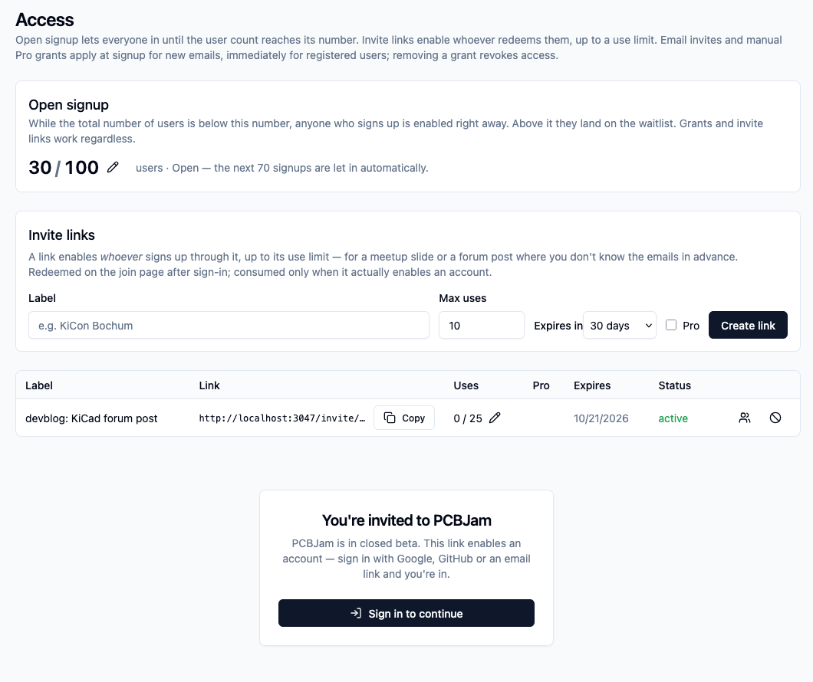
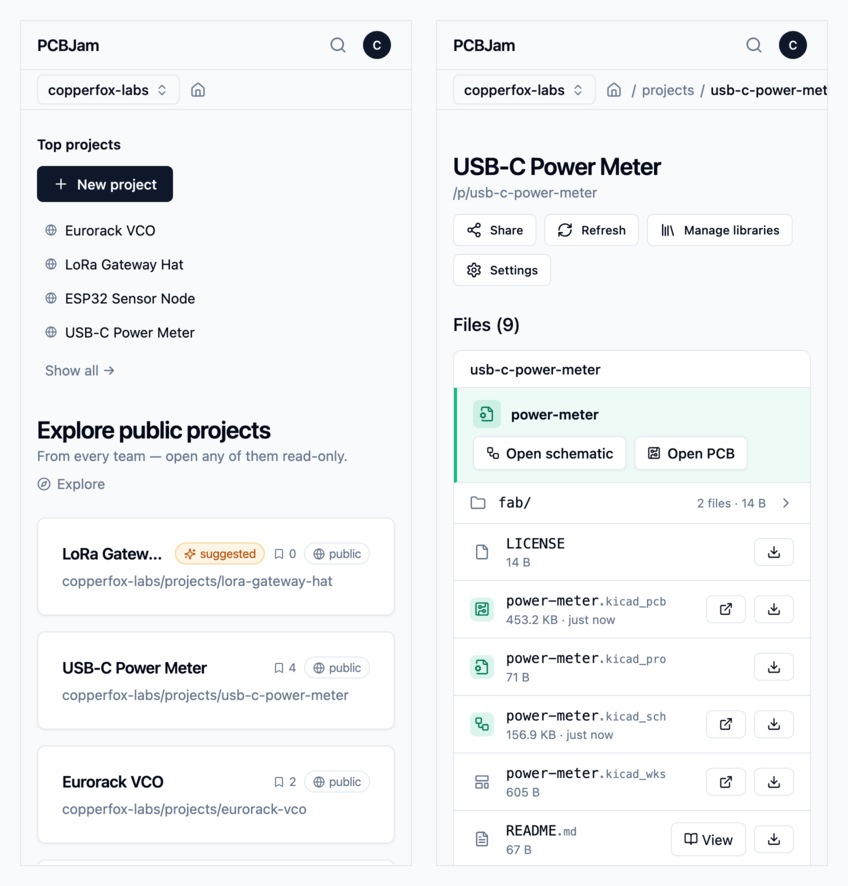
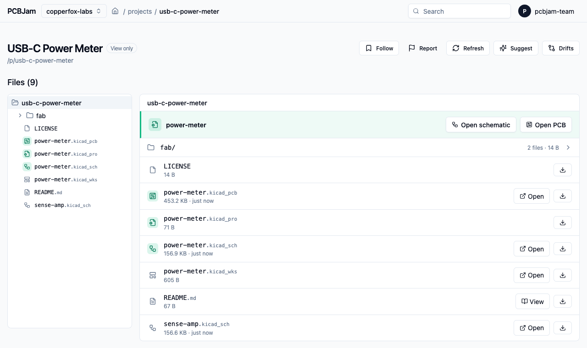
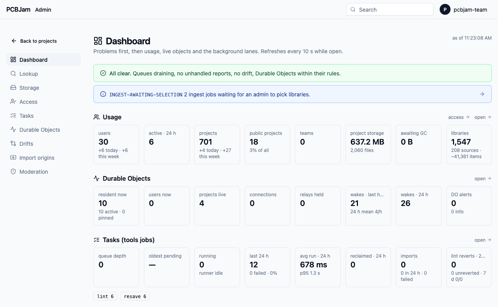
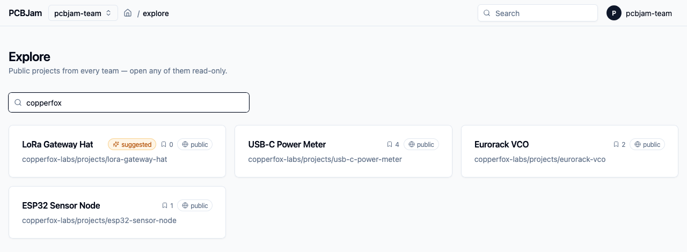

We promised a shorter post last time, and life helped us keep the promise: we were a bit sick (the classic post-conference souvenir), and the healthy hours mostly went into something that does not show up in a changelog. We were writing to people.

# The half-closed beta

Until last week the landing page had a waitlist form. Last week we started the closed beta, whitelisted every email address on our waitlist, and sent out a "closed beta" email.

Then we got a bit impatient, so we added two new features: "beta invite URLs" and "global slots".

The landing page has a "Go to app" button now, and behind it there are three ways in:

- **Open signup, up to a number.** While the total number of users is under a cap we set, anyone who signs up is simply let in. When we reach the cap, new signups land on the waitlist page again until we raise it. We can move the number from the admin UI, without a re-deploy.
- **Invite links.** A link with a use limit and an expiry, for the cases where we do not know the emails in advance: a forum post, a meetup slide, a mailing list. "The first 25 of you are in." The link enables whoever redeems it, and a dead link tells you where our Discord is instead of just saying no.
- **Email invites**, as before, for people we already know.

That is why we call it half-closed: it is still a closed beta, we still control how fast people come in (the servers and a small team both have limits), but you no longer need to wait for a human.

If you want in: go to [pcbjam.com](https://pcbjam.com), press the button. If you hit the waitlist, come to our Discord and ask, we have links.

# Writing to people

The KiCon lesson was that the product is more interesting to people than we managed to show, and that nobody will find it by accident. So most of my week went into outreach: we mapped the places where KiCad users actually are (hackerspaces, university labs and student teams, open hardware groups, forums and Discords, in Hungary, in the region and further), and started writing to them one by one. Actual messages, handwritten to every target, asking whether they would try a board with us and tell us what breaks.

I wrote about 7-8 emails, and we got some interesting leads. We want to get early adopters, and the best way to get them is something personal, even if it is a lot of effort. (Also, you can write emails from your bed with a fever, so it is the "best" activity to do when you are ill.)

If you run a hackerspace, teach electronics, or have a team that reviews boards together, write to us. We are happy to set up a team for you and sit with you for the first session.

# What went to production

Three releases went out: v0.2.2, v0.2.3 and v0.2.4.

## Comment links, built

In the last post this was under "on paper". It is in production now:

- **Per-project roles and comment links.** You can share a link that lets someone comment on your board without being able to edit it, and without joining your team.
- **Following** a public project.
- **Commenters are visible in the editor.** A reviewer's cursor and selection show up for the people editing, with their own look (a speech bubble nameplate), so you can see what the person commenting is pointing at.
- **Moderation**: reporting a comment, remove and restore, banning spammers, hiding a project. The boring part that you need the day you open the door, so it went in before we opened the door.
- Read-only sessions got a selection filter strip and an "Open PCB / schematic" row to jump to the other half of the project.

## Phones

iOS 27 is out, so iPhones can open projects now, thanks to the JSPI API shipped with the latest Safari version.

Nobody will route a board on a phone. But people do open links on a phone: someone sends you a project, a comment notification arrives, you want to look at a schematic on the train.

- The **platform UI fits a phone** now: dashboard, project pages, team settings, dialogs. Nothing scrolls sideways at 390 pixels.
- When a team member opens a design file on a phone or tablet, we **ask first**: view only, comment only, or the full editor. The view and comment modes boot a much lighter session, which matters a lot on a phone's memory budget. Visitors without edit rights never see the question.

## The project page reads like a project

The file browser got file-kind icons, the extensions are muted so the names are readable, and the three files that make up a KiCad project (`.kicad_pro`, `.kicad_sch`, `.kicad_pcb`) are highlighted together. Above the list there is one distinct row with "Open schematic" and "Open PCB", because that is what nine out of ten visits are for, and before this you had to find the right row first.

## Editor

- **Paste follows the cursor.** Pasting a symbol or a footprint used to drop it somewhere and update only when you clicked. Now it hangs on your cursor and moves with it, like on the desktop. The fix was in our wxWidgets port: mouse motion and timers were not delivered while the C++ side was parked inside the paste tool. It took three tries to get right, because the first two versions also delivered timers in places where KiCad really does not expect them (the board-load progress dialog, the symbol editor boot).
- **Import from file** (plugins PoC): place a local `.kicad_sym` or `.kicad_mod` on the canvas. It goes through the editor's own placement tool, so it behaves like any other placed item. This was mainly built as a proof of concept for our next big feature, the plugins.
- A regression test now guards a scary one: **footprints getting lost** across a switch between the schematic and the PCB editor.

## A sync audit

We had the Yjs binding (the layer that turns KiCad documents into mergeable collaborative documents) audited, first at unit level, then end to end. Six findings, all six reproduced, all six fixed, each with its regression test. They were all edge cases of the "two things happen at the same moment" kind: two clients seeding the same empty document, a local edit racing a teammate's delete (delete wins now, the item does not come back from the dead), the server healing a document layout on load instead of trusting every client to do it.

As far as we know, none of these ever hit a user. We would like to keep it that way.

## Less wasted work

- **Lint ran far too often.** Every save poked the linter, even when the text of the file did not change. Now the poke is gated on real content changes, an unchanged file is skipped by hash, and a busy runner backs off instead of piling up a queue.
- **Teams can remove KiCad's default libraries** they do not use. With around 400 official libraries, this is the difference between a symbol chooser you scroll and one you read. (Also, this can make the first editor load much faster.)

## Looking at our own system

We built ourselves an admin dashboard: problems first, then usage, live rooms, background jobs. Plus a page for the Durable Objects behind the realtime rooms (which ones are alive, why, since when), and a storage browser that pages instead of listing everything. Not a user feature, but the beta is the reason: when strangers start using your system, "I think it is fine" is not monitoring.

# In the queue

These are on staging, green, and will most likely be in production by the time you read this.

- **Explore shows followers.** Public projects show their follower count, the list is ranked by it, and we can mark projects as "suggested" so a new visitor sees something worth opening first.

- **A plugin system, in preview.** This is the big one in the queue. Plugins run in a sandbox (QuickJS in a worker for the logic, a sandboxed iframe for the UI), get only the permissions their manifest asks for, and show up as floating, resizable panels in the editor. There is an SDK, a TypeScript + React starter, and a developer guide inside the editor. Once plugin access is enabled for your account you can install a private plugin for yourself, and a plugin can talk to its own backend through an approved, identity-bound channel. It is **staging only**: production editor builds have it explicitly switched off until we are happy with the security story. It will get its own post.
- **Two drift fixes.** Our drift detector compares what the collaborative document says with what the editor saves, and it found two real mismatches in production. One was an upstream KiCad gap: copying a footprint dropped its unit info, so the synced copy lost a `(units …)` block the saved file had. A three-line fix. The other was the detector being too strict about orphaned symbol definitions that KiCad itself drops on save.
- **Library wording.** "Pin" and "Unpin" became "Add", "Remove" and "Add back". Nobody understood what pinning a library meant, including, some days, us.
- **Newsletter opt-in.** With the waitlist gone, the "tell me about updates" checkbox went with it. It is back, on the one-time welcome step and on the landing page. Opt-in, off by default.
- More admin quality of life (per-tool queue stats, a lookup page), a few e2e de-flakes, and the deploy now waits for the matching editor build before it runs migrations.

# On paper

One design document this week: **Git integration**. Connect a project to any Git remote, work on branches as separate working copies (and still collaborate live with whoever picked the same one), choose files to commit, push. No in-app conflict resolution and no force pushes, on purpose. At least three KiCon talks were about versioning hardware projects, so this one did not come from nowhere.

Stay healthy. Wash your hands after conferences.
